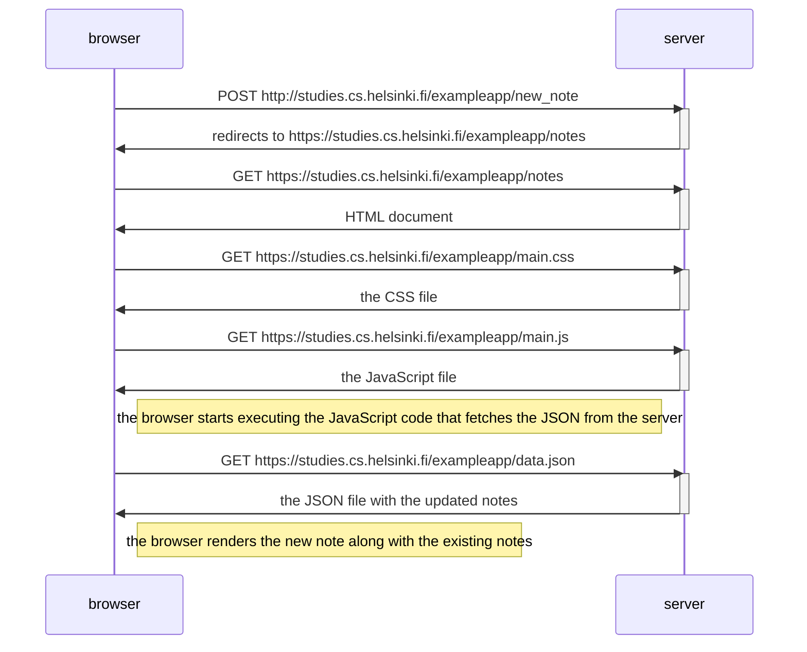

```mermaid
sequenceDiagram
    participant browser
    participant server

    browser->>server: POST http://studies.cs.helsinki.fi/exampleapp/new_note
    activate server
    server->>browser: redirects to https://studies.cs.helsinki.fi/exampleapp/notes
    deactivate server

    browser->>server: GET https://studies.cs.helsinki.fi/exampleapp/notes
    activate server
    server->>browser: HTML document
    deactivate server

    browser->>server: GET https://studies.cs.helsinki.fi/exampleapp/main.css
    activate server
    server->>browser: the CSS file
    deactivate server

    browser->>server: GET https://studies.cs.helsinki.fi/exampleapp/main.js
    activate server
    server->>browser: the JavaScript file
    deactivate server

    Note right of browser: the browser starts executing the JavaScript code that fetches the JSON from the server

    browser->>server: GET https://studies.cs.helsinki.fi/exampleapp/data.json
    activate server
    server->>browser: the JSON file with the updated notes
    deactivate server

    Note right of browser: the browser renders the new note along with the existing notes
```