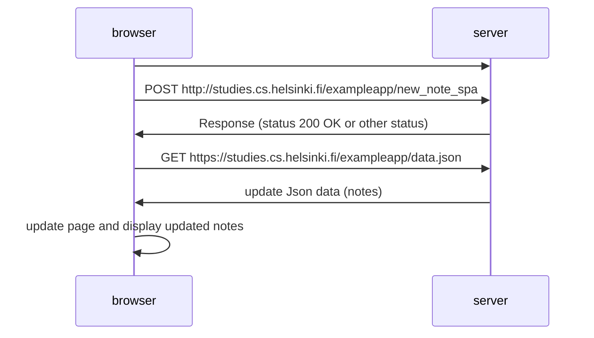

```mermaid
sequenceDiagram
    participant browser
    participant server

    browser->>server: 
    browser->>server: POST http://studies.cs.helsinki.fi/exampleapp/new_note_spa
    server->>browser: Response (status 200 OK or other status)

    browser->>server: GET https://studies.cs.helsinki.fi/exampleapp/data.json
    server->>browser: update Json data (notes)

    browser->>browser: update page and display updated notes
```